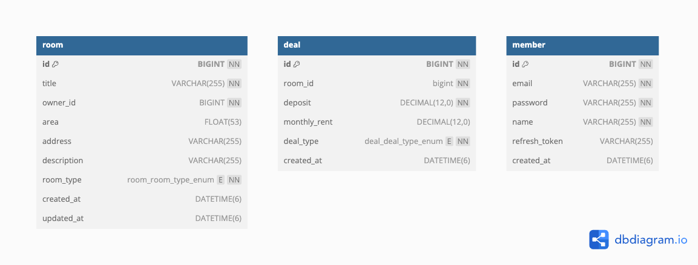

# 헥사고날 아키텍처 실습


## 프로젝트 구조

```
hexagonal-architecture/
├── hexagonal-api/          # 웹 계층 (Controller, Service, Security)
├── hexagonal-common/       # 공통 객체 (DTO, Exception)
├── hexagonal-domain/       # 도메인 모델 및 Repository 인터페이스
├── hexagonal-infra/        # 인프라 계층 (Repository 구현체)
├── docker-compose.yml      # docker-compose 로컬 환경 파일
├── init.sql                # 데이터베이스 초기화 스크립트
├── APISpec.md              # API 스펙 문서
├── output                  # 빌드 후 필요한 파일들 위치 (빌드시 생성됨)
└── README.md
```


## 빌드

빌드시 단위테스트와 통합테스트 환경을 구분하여 빌드 할 수 있습니다.

### 테스트 수행 없이 빌드

```
./gradlew clean build -x test
```

### 단위테스트만 수행

``` bash
./gradlew clean build
```

### 단위테스트 + 통합테스트 수행

>  ⚠️ <u>중요: 통합 테스트 및 시나리오 테스트는 Testcontainer 를 통해 수행합니다. Docker 엔진이 기동중인 상태여야 합니다.</u>

``` bash
$ ./gradlew clean build -Pintegration-test
```

</br>


### 빌드 결과물

위 명령어는 다음과 같은 작업을 수행합니다:

1. **소스 컴파일**: 모든 Java 소스 코드 컴파일
2. **테스트 코드 실행**: 단위 테스트 및 통합 테스트 수행
3. 프로젝트 빌드: 프로젝트 루트의 `output` 디렉토리에 다음 파일들을 생성합니다.
   - `realestate-api-0.0.1.jar`: 실행 가능한 메인 애플리케이션 JAR
   - `application.yml`: 애플리케이션 기본 설정 파일
   - `infra.yml`: infra 모듈 설정 파일
   - `docker-compose`: 애플리케이션 실행시 필요한 mysql docker compose 설정 파일
   - `init.sql`: mysql docker compose 기동시 실행할 DB 초기화 쿼리


</br>


## 실행 방법

> ⚠️ **중요**: [빌드](#빌드) 과정이 선행되어야 합니다.

### 1. 설정 파일 구성

- `docker-compose.yml`

  ``` yaml
  services:
    db:
      image: mysql:9.1
      container_name: hexagonal_mysql
      ports:
        - 3306:3306
      environment:
        MYSQL_ROOT_PASSWORD: root
        MYSQL_DATABASE: hexagonal
        MYSQL_USER: sssukho
        MYSQL_PASSWORD: sssukho1234
        T: Asia/Seoul
      volumes:
        - ./data/mysql:/var/lib/mysql
        - ./init.sql:/docker-entrypoint-initdb.d/init.sql
      platform: linux/arm64/v8
  
  ```

  - `services.db.ports`: {호스트 포트번호} : {컨테이너 내부 포트번호} 매핑 관계. 필요시 수정 가능
  - `services.db.environment`: mysql 설정값. 필요시 수정 가능하나, infra.yml 내 datasource 정보도 맞춰서 수정 필요
  - `services.db.deploy.*`: 리소스 사용 제한 설정값. 필요시 수정 가능 (삭제 가능)
  - `services.db.volumes`
    - ./data/mysql: mysql 컨테이너에서 사용하는 데이터 파일의 호스트 경로
    - ./init.sql: 컨테이너 최초 생성시 실행되는 초기 쿼리

- `application.yml`

  ``` yaml
  spring:
    application:
      name: hexagonal-api
    config:
      import: classpath:infra.yml
  
  server:
    port: 8080
    tomcat:
      uri-encoding: UTF-8
    shutdown: graceful
  
  secret:
    jwt:
      secret: hexagonalarchiecturesecretkey2025!@
      accessTokenExpirationMs: 1800000 # 30분
      refreshTokenExpirationMs: 86400000 # 24시간
  ```

  - `server.port`: 에플레케이션에서 사용하는 포트 설정값. 필요시 수정 가능
  - `secret.jwt`: jwt 관련 설정값. 필요시 수정 가능

- `infra.yml`

  ``` yaml
  spring:
    datasource:
      url: jdbc:mysql://127.0.0.1:3306/hexagonal?serverTimezone=Asia/Seoul&useUnicode=true&characterEncoding=UTF-8&rewriteBatchedStatements=true
      driver-class-name: com.mysql.cj.jdbc.Driver
      username: sssukho
      password: sssukho1234
      hikari:
        data-source-properties:
          rewriteBatchedStatements: true
      p6spy:
        enable-logging: false
        logging: slf4j
  
    jpa:
      show-sql: false
      hibernate:
        dialect: org.hibernate.dialect.MySQL8Dialect
        ddl-auto: none
        format_sql: false
      properties:
        hibernate:
          jdbc:
            batch_size: 100
  
  logging:
    level:
      p6spy: OFF
      com.p6spy: OFF
      org.springframework.jdbc: INFO
  
  ```
  
  - `spring.datasource.url`: datasource url 설정 값. 필요시 변경 가능하나 docker-compose 파일에 맞춰 수정 필요


### 2. Docker Compose 실행

프로젝트 루트 경로의 `output` 디렉토리로 이동해서 다음 명령어를 실행해주시기 바랍니다.

``` shell
docker compose up -d
```


### 3. 애플리케이션 실행

프로젝트 루트 경로의 `output` 디렉토리로 이동해서 다음 명령어를 실행해주시기 바랍니다.

``` shell
java -jar hexagonal-api-0.0.1.jar --spring.config.location=file:./application.yml,file:./infra.yml
```


</br>


## 테스트

1. **단위 테스트**
   - 각 모듈별 독립적인 단위 테스트
   - Mockito를 활용한 의존성 모킹
2. **통합 테스트**
   - Testcontainer를 활용한 실제 데이터베이스 환경과 최대한 유사하도록 테스트
   - `@Tag("integration-test")` 어노테이션으로 구분
3. **시나리오 테스트**
   - 실제 사용자 플로우 검증

### 테스트 실행

```bash
# 단위 테스트만 실행
./gradlew test

# 통합 테스트 포함 실행
./gradlew test -Pintegration-test
```


</br>


## API 스펙

[APISpec.md](./APISpec.md) 문서를 참고 해주시기 바랍니다.


</br>


## 설계 의도

### 1. 멀티 모듈 아키텍처

멀티 모듈 아키텍처 적용 의도는 다음과 같습니다.

1. **유지보수성 향상**: 계층별 코드 분리로 높은 유지보수성 확보
2. **재사용성**: 모듈 단위로 다른 프로젝트에서도 조합하여 재사용 가능
3. **테스트 범위 명확화**: 모듈 단위로 단위/통합 테스트 구분
4. **협업 효율성**: 모듈별 작업 범위 분리로 개발자간 충돌 최소화

#### 모듈 구성

- **`hexagonal-api`**: 웹 계층
  - REST API 엔드포인트 (`AuthController`, `RoomController`)
  - 비즈니스 로직 (`AuthService`, `RoomService`)
  - JWT 기반 인증 로직
- **`hexagonal-common`**: 공통 객체
  - 요청/응답 DTO 클래스
  - 공통 예외 클래스 (`CustomException`)
- **`hexagonal-domain`**: 도메인 모델
  - 핵심 비즈니스 도메인 모델 (`Room`, `Member`, `Deal`)
  - Repository 인터페이스 정의
- **`hexagonal-infra`**: 외부 시스템 접근
  - Repository 구현체 (`RoomRepositoryImpl`, `MemberRepositoryImpl`, `DealRepositoryImpl` 등)
  - 데이터베이스 연동 담당

### 2. 데이터베이스 설계



```sql
CREATE TABLE IF NOT EXISTS room (
  id BIGINT NOT NULL AUTO_INCREMENT,
  title VARCHAR(255) NOT NULL,
  owner_id BIGINT NOT NULL,
  area FLOAT(53),
  address VARCHAR(255),
  description VARCHAR(255),
  room_type enum ('ONE_ROOM','THREE_ROOM','TWO_ROOM') NOT NULL,
  created_at DATETIME(6),
  updated_at DATETIME(6),
  primary key (id)
) engine=InnoDB;
CREATE INDEX idx_room_owner_id ON room(owner_id);
CREATE INDEX idx_room_room_type ON room(room_type); -- 조건 검색시
CREATE INDEX idx_room_created_at_desc ON room (created_at DESC); -- 정렬 조건

CREATE TABLE IF NOT EXISTS deal (
  id BIGINT NOT NULL AUTO_INCREMENT,
  room_id bigint NOT NULL,
  deposit DECIMAL(12,0) NOT NULL,
  monthly_rent DECIMAL(12,0),
  deal_type enum ('MONTHLY_RENT','YEAR_RENT') NOT NULL,
  created_at DATETIME(6),
  PRIMARY KEY (id)
 ) engine=InnoDB;
CREATE INDEX idx_deal_room_id ON deal(room_id);
CREATE INDEX idx_deal_type_deposit_monthly_rent ON deal(deal_type, deposit, monthly_rent); -- 전체 검색시
CREATE INDEX idx_deposit_monthly_rent ON deal(deposit, monthly_rent);  -- 조건 검색시
CREATE INDEX idx_deal_type_monthly_rent ON deal(deal_type, monthly_rent); -- 조건 검색시
CREATE INDEX idx_monthly_rent ON deal(monthly_rent);  -- 조건 검색시


CREATE TABLE IF NOT EXISTS member (
  id BIGINT NOT NULL AUTO_INCREMENT,
  email VARCHAR(255) NOT NULL,
  password VARCHAR(255) NOT NULL,
  name VARCHAR(255) NOT NULL,
  refresh_token VARCHAR(255),
  created_at DATETIME(6),
  PRIMARY KEY (id)
) engine=InnoDB;
CREATE UNIQUE INDEX idx_member_email ON member(email);

```

### 3. 보안 설계

- **JWT 토큰 기반 인증**: Stateless 인증 방식 적용
- **패스워드 해싱**: BCrypt 해시 알고리즘 사용


</br>


## 개발 환경

- **JVM**: 17
- **Build Tool**: Gradle 8.4
- **Framework**: Spring Boot 3.3.12
  - Spring Data JPA
  - Spring Security
  - Spring Web
- **Database**: MySQL 9 (Docker Compose)
- **Testing**: JUnit 5, Mockito, Testcontainers
- **OS**: macOS (ARM64 지원)

